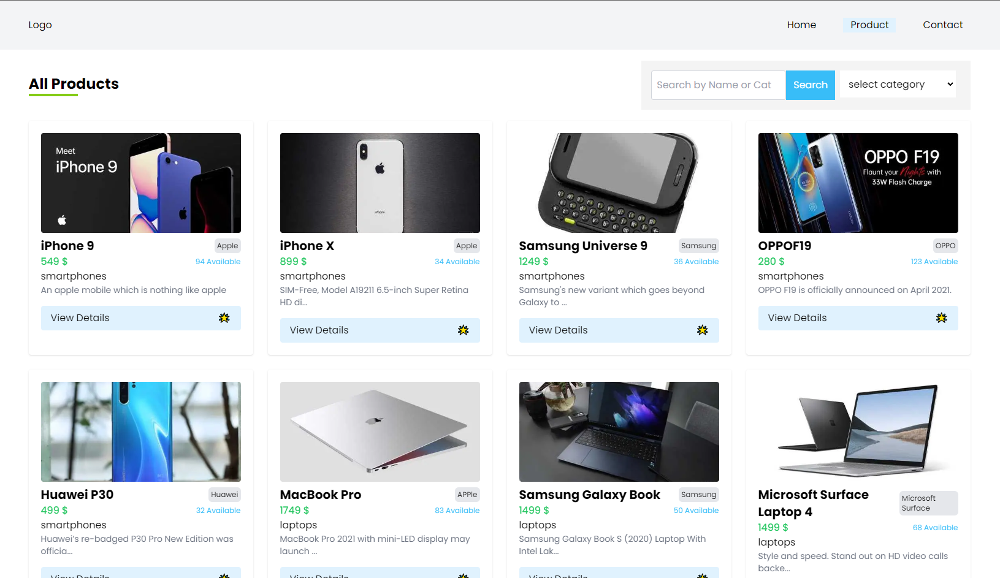

## Products List App by NextJs

This is very first time application using NextJs framework.

I am pretty happy to create it.

## Using Technologies & Packages

```
"dependencies": {
    "@reduxjs/toolkit": "^1.8.6",
    "next": "12.3.1",
    "react": "18.2.0",
    "react-dom": "18.2.0",
    "react-redux": "^8.0.4",
    "sass": "^1.55.0"
  },

  "devDependencies": {
    "autoprefixer": "^10.4.12",
    "eslint": "8.25.0",
    "eslint-config-next": "12.3.1",
    "postcss": "^8.4.18",
    "tailwindcss": "^3.1.8"
  }

```

## Using Dummy API Endpoints

#### [https://dummyjson.com/docs/products](https://dummyjson.com/docs/products)

## Image Preview for App



> Thanks for reach out me on Github.
